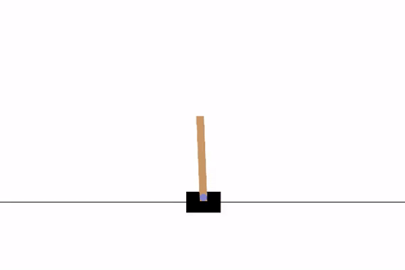

# CartPole Q-Learning

This repository contains code to train and evaluate a Q-Learning agent for the CartPole environment using the Gymnasium library. It includes scripts for training the agent, evaluating a random strategy, and visualizing the results.

## Files in the Repository

- **`cartpole_random.py`**: Script to run a random policy on the CartPole environment and visualize the performance.
- **`main.py`**: Main script to train a Q-Learning agent, simulate the learned strategy, and visualize the convergence of the training process.
- **`Q_Learning.py`**: Implementation of the Q-Learning algorithm used for training the agent.

## Requirements

- Python 3.x
- Gymnasium
- NumPy
- Matplotlib

You can install the required libraries using:

```sh
pip install gymnasium numpy matplotlib
```

## Usage

### Running a Random Policy

To run a random policy on the CartPole environment and visualize the results, execute:

```sh
python cartpole_random.py
```

### Training the Q-Learning Agent

To train the Q-Learning agent and visualize the convergence:

1. Ensure you have all the dependencies installed.
2. Run the main script:

```sh
python main.py
```

This will train the agent, visualize the convergence plot, and save it as `convergence.png`. It will also display the rewards histogram for the random strategy.

## Q-Learning Implementation

The Q-Learning algorithm is implemented in `Q_Learning.py` with the following main components:

- **State Discretization**: Discretizes the continuous state space into bins for easier Q-Learning implementation.
- **Q-Learning Algorithm**: Core algorithm to update the Q-values based on the agent's experience.
- **Simulation Methods**: Methods to simulate episodes using either the learned Q-values or a random strategy.

## Performance

### Random Policy


### Trained Policy



## Acknowledgements

This project uses the Gymnasium library to create and interact with the CartPole environment.
