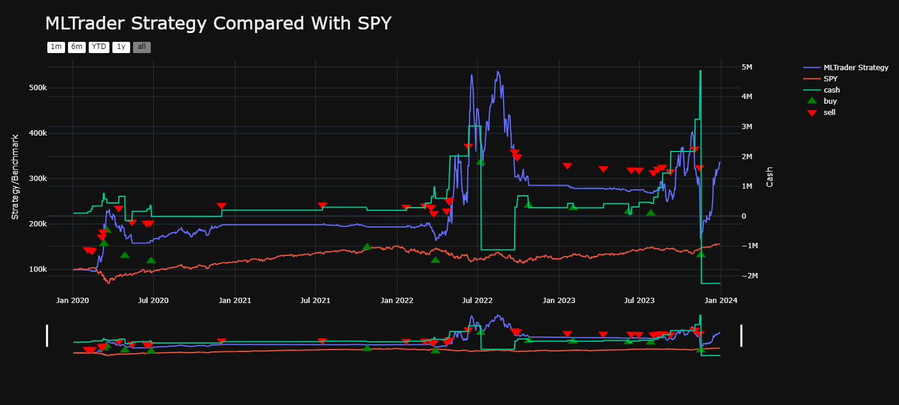
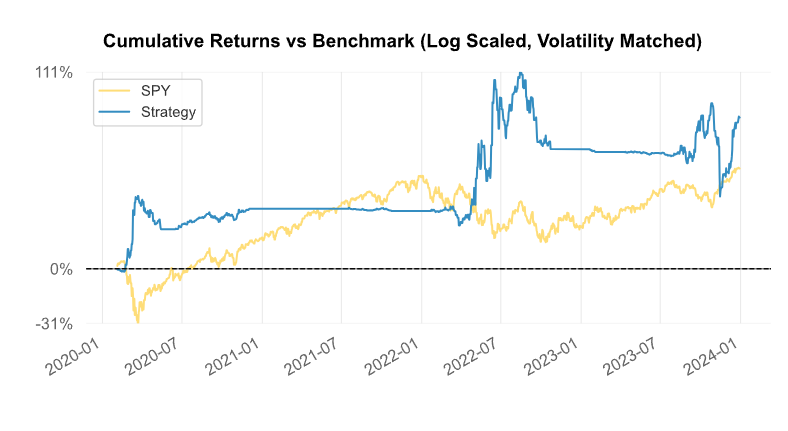
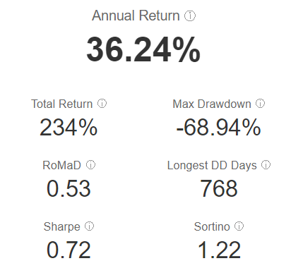
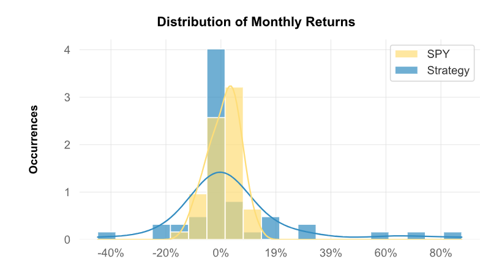

# MLTrader Stock Trading Bot

## Overview

This project involves the development of an automated stock trading bot using machine learning for sentiment analysis. The bot, named **MLTrader**, leverages the Alpaca API for executing trades and utilizes the FinBERT model for sentiment estimation from news headlines. The bot makes trading decisions based on the sentiment of recent news related to a particular stock.

## Features

- **Sentiment Analysis**: Uses FinBERT to analyze the sentiment of news headlines.
- **Automated Trading**: Integrates with Alpaca API to execute trades based on sentiment analysis.
- **Backtesting**: Allows for backtesting strategies over historical data using Yahoo Finance.

## Results

### Dashboard


### Cumulative Return and Annual Return Metric
 

### Monthly Returns


## Getting Started 🚀

### Prerequisites

- **Python 3.10**
- **Alpaca Account**: Sign up for an Alpaca account to get your API keys.

### Installation

1. **Create a virtual environment**:
    ```sh
    conda create -n trader python=3.10
    ```

2. **Activate the virtual environment**:
    ```sh
    conda activate trader
    ```

3. **Install initial dependencies**:
    ```sh
    pip install lumibot timedelta alpaca-trade-api==3.1.1
    ```

4. **Install PyTorch and Transformers**:
    ```sh
    pip install torch torchvision torchaudio transformers
    ```

### Setup

1. **Update the API_KEY and API_SECRET** with values from your Alpaca account.

### Running the Bot

To run the bot, execute:
```sh
python tradingbot.py
```

**Note**: Torch installation instructions will vary depending on your operating system and hardware. See here for more: [PyTorch Installation Instructions](https://pytorch.org/get-started/locally/)

### SSL Error Fix (if needed)

If you encounter an SSL error when attempting to call out to the Alpaca Trading API, you'll need to install the required SSL certificates on your machine.

1. **Download the following intermediate SSL Certificates**:
    - [Let's Encrypt R3](https://letsencrypt.org/certs/lets-encrypt-r3.pem)
    - [ISRG Root X1 Cross-Signed](https://letsencrypt.org/certs/isrg-root-x1-cross-signed.pem)

2. **Install the certificates**:
    - Change the file extension of each file to `.cer`
    - Double-click the file and run through the wizard to install it, using all of the default selections.

## Other References 🔗

- **Lumibot**: Trading bot library that simplifies lifecycle management.
