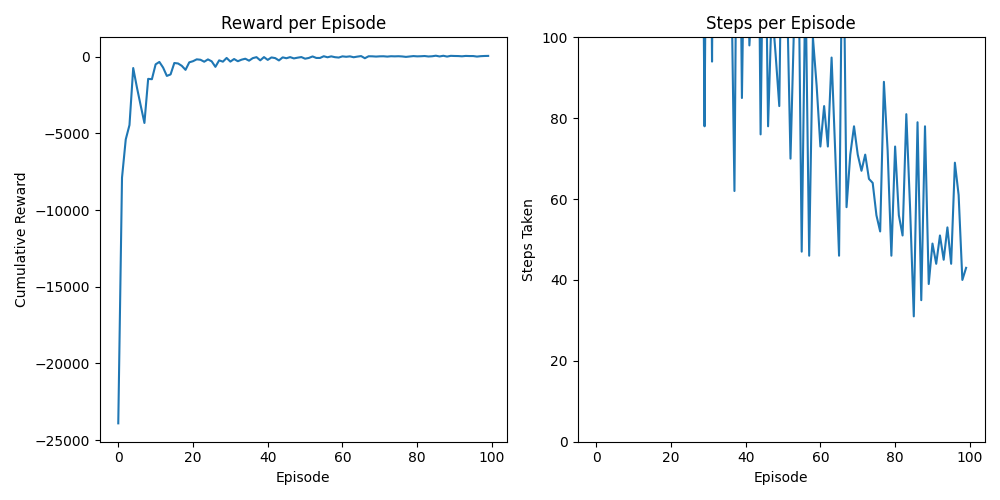
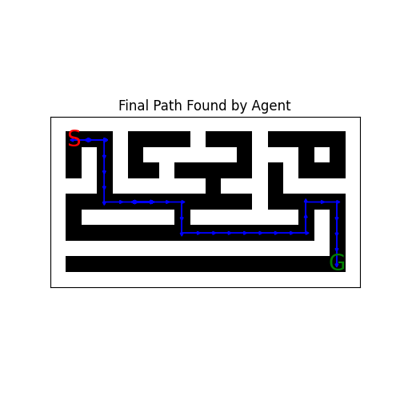
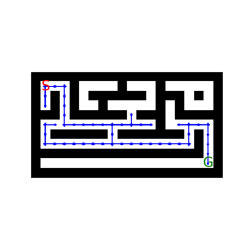
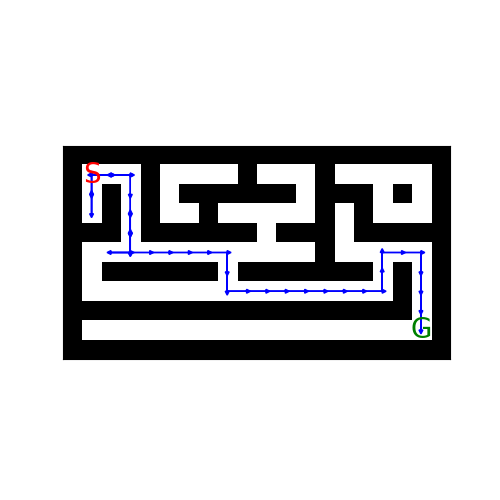
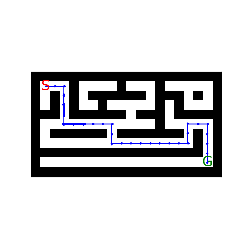

# Maze Project

Welcome to the Maze Project repository! This project utilizes reinforcement learning to solve mazes.

## Overview

This repository contains Python scripts and results related to maze solving using reinforcement learning techniques.

## Results

In the `results` folder, you can find several outputs:

### Graph Representation

*Graphical representation of maze structure or learning progress.*

### Learned Path

*Path learned by the agent in the maze.*

### Maze Solving Steps

#### Step 1

*Step 1 description.*

#### Step 2

*Step 2 description.*

#### Step 3

*Step 3 description.*

## Python Script Files

The project includes the following Python scripts:

- `agent.py`: Defines the agent that interacts with the maze environment.
- `main.py`: Main script to run and coordinate the training or testing of the agent.
- `maze_env.py`: Implements the maze environment where the agent learns and operates.

## Usage

To use this project:

1. Clone the repository.
2. Install dependencies listed in `requirements.txt`.
3. Run `main.py` to start training or testing the agent in the maze environment.

## Notes

This project is intended for educational purposes, demonstrating maze solving using reinforcement learning techniques. Feel free to explore and modify the code as needed.
